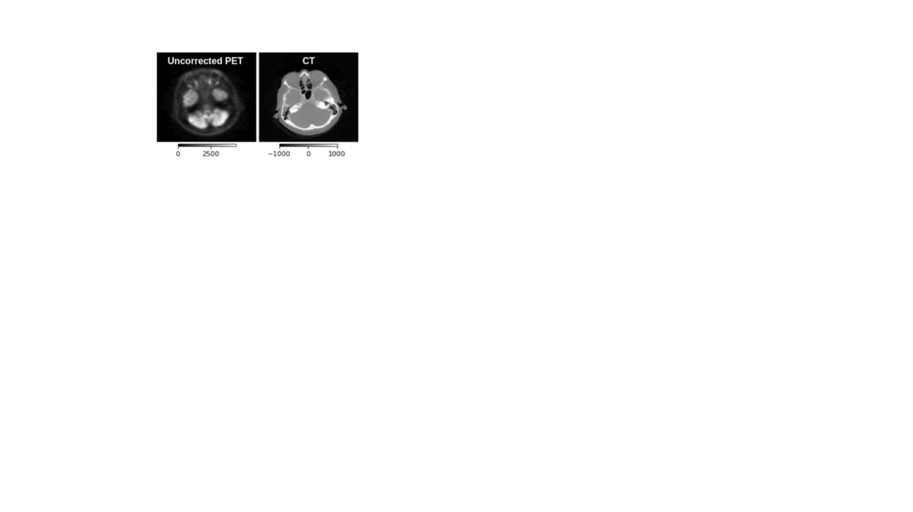

# UncerGuidedI2I
[PyTorch](https://pytorch.org/) imeplementation of [Uncertainty Guided Progressive GANs for Medical Image Translation](https://arxiv.org/abs/2106.15542)

## Introduction


This repository provides the code for the **MICCAI-2021** paper titled "[Uncertainty-guided Progressive GANs for Medical Image Translation](https://arxiv.org/abs/2106.15542)". 
We take inspiration from the progressive learning scheme demonstrated at [MedGAN](https://arxiv.org/abs/1806.06397) and [Progressive GANs](https://arxiv.org/abs/1710.10196), and augment the learning with the estimation of intermediate uncertainty maps (as presented [here](http://www.gatsby.ucl.ac.uk/~balaji/udl2020/accepted-papers/UDL2020-paper-061.pdf) and [here](https://arxiv.org/pdf/2102.11747.pdf)), that are used as attention map to focus the image translation in poorly generated (highly uncertain) regions, progressively improving the images over multiple phases.



The structure of the repository is as follows:
```
root
 |-ckpt/ (will save all the checkpoints)
 |-data/ (save your data and related script)
 |-src/ (contains all the source code)
    |-ds.py 
    |-networks.py
    |-utils.py
    |-losses.py
```

## Getting started
### Requirements
```
python >= 3.6.10
pytorch >= 1.6.0
jupyter lab
torchio
scikit-image
scikit-learn
```

### Preparing Datasets
The experiments of the paper used T1 MRI scans from the IXI dataset and a proprietary PET/CT dataset.

`data/IXI/` has jupyter notebooks and scripts to prepare the data for motion correction (`data/IXI/prepare_motion_correction_data.py` and `data/IXI/viz_motion_correction_data.ipynb`) as well as undersampled MRI reconstruction (`data/IXI/viz_kspace_undersample_data.ipynb`).
For custom datasets, use the above notebooks as example to prepare the dataset and place them under `data/`. The dataset class in `src/ds.py` loads the paired set of images (corrupted and the non-corrupted version).

### Learning models with uncertainty
`src/networks.py` provides the generator and discriminator architectures.

`src/utils.py` provides two training APIs `train_i2i_UNet3headGAN` and `train_i2i_Cas_UNet3headGAN`. The first API is to be used to train the primary GAN, whereas the second API is to be used to train the subsequent GANs. 

An example command to use the first API is:
```python
netG_A = CasUNet_3head(1,1)
netD_A = NLayerDiscriminator(1, n_layers=4)
netG_A, netD_A = train_i2i_UNet3headGAN(
    netG_A, netD_A,
    train_loader, test_loader,
    dtype=torch.cuda.FloatTensor,
    device='cuda',
    num_epochs=50,
    init_lr=1e-5,
    ckpt_path='../ckpt/i2i_0_UNet3headGAN',
)
```
This will save checkpoints in `../ckpt/` named as `i2i_0_UNet3headGAN_eph*.pth`

An example command to use the second API (here we assumed the primary GAN and first subsequent GAN are trained already):
```python
# first load the prior Generators 
netG_A1 = CasUNet_3head(1,1)
netG_A1.load_state_dict(torch.load('../ckpt/i2i_0_UNet3headGAN_eph49_G_A.pth'))
netG_A2 = UNet_3head(4,1)
netG_A2.load_state_dict(torch.load('../ckpt/i2i_1_UNet3headGAN_eph49_G_A.pth'))

#initialize the current GAN
netG_A3 = UNet_3head(4,1)
netD_A = NLayerDiscriminator(1, n_layers=4)

#train the cascaded framework
list_netG_A, list_netD_A = train_uncorr2CT_Cas_UNet3headGAN(
    [netG_A1, netG_A2, netG_A3], [netD_A],
    train_loader, test_loader,
    dtype=torch.cuda.FloatTensor,
    device='cuda',
    num_epochs=50,
    init_lr=1e-5,
    ckpt_path='../ckpt/i2i_2_UNet3headGAN',
)
```

### Bibtex
If you find the bits from this project helpful, please cite the following works:
```
@inproceedings{upadhyay2021uncerguidedi2i,
  title={Uncertainty Guided Progressive GANs for Medical Image Translation},
  author={Upadhyay, Uddeshya and Chen, Yanbei and Hebb, Tobias and Gatidis, Sergios and Akata, Zeynep},
  booktitle={International Conference on Medical Image Computing and Computer-Assisted Intervention (MICCAI)},
  year={2021},
  organization={Springer}
}
```
and
```
@article{upadhyay2021uncertainty,
  title={Uncertainty-aware Generalized Adaptive CycleGAN},
  author={Upadhyay, Uddeshya and Chen, Yanbei and Akata, Zeynep},
  journal={arXiv preprint arXiv:2102.11747},
  year={2021}
}
```
