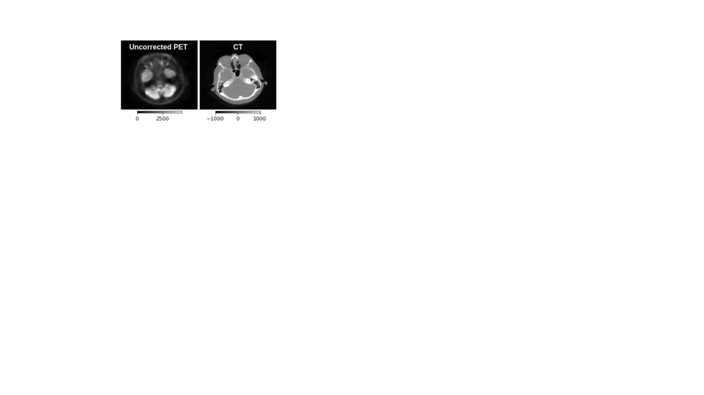

# UncerGuidedI2I
Uncertainty Guided Progressive GANs for Medical Image Translation


This repository provides the code for the MICCAI-2021 paper "Uncertainty-guided Progressive GANs for Medical Image Translation". 
We take inspiration from the progressive learning scheme demonstrated at MedGAN and Progressive GANs, and augment the learning with the estimation of intermediate uncertainty maps, that are used as attention map to focus the image translation in poorly constructed (highly uncertain) regions, progressively improving the images over multiple phases.



The structure of the repository is as follows:
```
root
 |-ckpt/ (will save all the checkpoints)
 |-data/ (save your data and related script)
 |-src/ (contains all the source code)
    |-ds.py 
    |-networks.py
    |-utils.py
    |-losses.py
```

## How to use
### Requirements
```
pytorch > 1.6.0
torchio
scikit-image
scikit-learn
```

### Preparing Datasets
The experiments of the paper used T1 MRI scans from the IXI dataset and a propietary PET/CT dataset.

`data/IXI/` has jupyter notebooks to prepare the data for motion correction as well as undersampled MRI reconstruction.
For custom datasets, use the above notebooks as example to prepare the dataset and place them under `data/`. The dataset class in `src/ds.py` loads the paired set of images (corrupted and the non-corrupted version).

### Training


